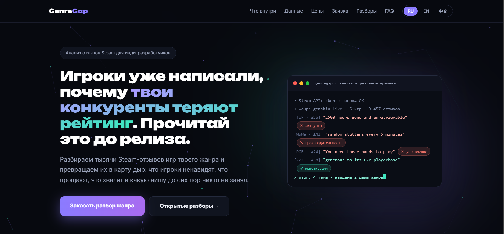
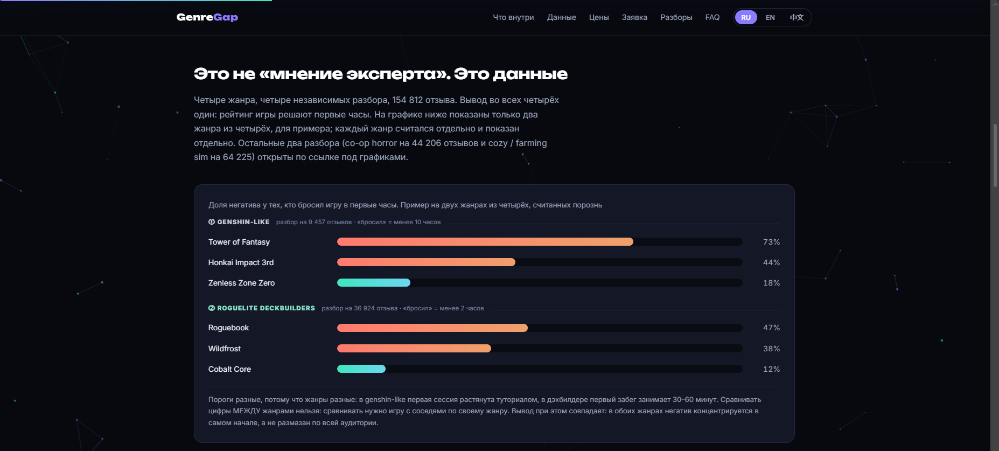

# Портфолио: Даниил Бобров

Full-stack и автоматизация. Семь блоков ниже: что сделано, на каком стеке и что именно можно открыть и проверить. Где код остался у заказчиков или под NDA, об этом сказано прямо, ссылок «в никуда» здесь нет.

**Контакты:** Twelve_one@outlook.com • UTC+3, удалённо

---

## 1. Job Radar: Telegram-бот мониторинга вакансий (код открыт)

**Репозиторий:** https://github.com/coloroflol21-sketch/job-radar (публичный, MIT)

Что внутри:

- Три источника без ключей: открытое API «Работа в России», RSS hh.ru, RSS «Хабра Карьеры».
- Фильтры по зарплате, опыту, формату, графику, свежести и ключевым словам, дедупликация и сортировка выдачи.
- Telegram-бот с инлайн-меню и командами: настройки без правки кода, избранное, статистика рынка.
- Отклик в три клика прямо из чата письмом по SMTP: подтверждение перед отправкой, защита от чужого chat_id, запрет повторной отправки.
- Отслеживание ответов работодателей через IMAP по заголовку In-Reply-To с уведомлениями в Telegram.
- Два режима работы: постоянно запущенный бот и разовый прогон по расписанию через GitHub Actions (cron, dry-run, секреты в настройках репозитория).
- 136 автоматизированных тестов, CI для Node.js 20 и 22, включая сценарии обработки команд.
- Вариант дайджеста в виде импортируемого workflow для n8n, без интерактивных команд.

Стек: Node.js, JavaScript, Telegram Bot API, SMTP/IMAP, GitHub Actions, n8n.

Инженерная деталь: API hh.ru закрыт OAuth и отдаёт 403 анонимам, поэтому используется RSS поиска, а свежесть решается собственным лимитом по возрасту вакансии.

## 2. Инструментарий поиска вакансий на Python (личная разработка, использую ежедневно)

Конвейер, которым я пользуюсь сам: восемь рабочих источников, среди них hh.ru в двух форматах (HTML-выдача и RSS), открытый API «Работа в России», remote-job.ru, SuperJob, «Хабра Карьера», вакантные Telegram-каналы и RemoteOK.

- Сбор и разбор HTML, JSON и XML: Python, requests, регулярки.
- Нормализация полей к единому виду и дедупликация по базе уже виденных id (более 2100 записей).
- Фильтры: регион, удалённая работа, без опыта, оклад от 25 000, плюс эвристика по слот-маркерам (аномальная вилка, безымянный работодатель, оплачиваемое «обучение» с наставником).
- Обработка частичных сбоев: недоступный источник не останавливает прогон, ошибки уходят в лог.
- Выход: промежуточные пулы в JSON и дайджесты в Markdown со ссылками, условиями и готовыми откликами.
- Реестр источников с вердиктами: сколько жрёт времени каждый источник и что даёт по факту.

Код локальный и в открытый доступ не выложен. По запросу покажу схему работы и живые артефакты прогона.

## 3. Тестовые задания и проверки навыков

- **Сверка УПД со сканом** (тестовое на hh.ru, 16.09.2026): 13 расхождений найдено и исправлено, итоги листа сходятся с «Всего к оплате». Инструмент: Google Таблицы. Ссылка: https://docs.google.com/spreadsheets/d/17kjDeMpK9DH16hbiU1MqxIMU775pY6aT20gJf-aSlC4/edit
- **Wazzup** (мессенджер для поддержки клиентов): все тестовые этапы сданы на 100%.
- **Курс чат-менеджера:** шесть этапов теории пройдены, тренировочный тест на внимательность 20 из 20.

Это не коммерческий опыт, а проверяемые результаты: точность с данными и грамотность.

## 4. Клиентские проекты (код остался у заказчиков, показываю описания)

- **Дашборды в Excel и Google Sheets:** переиспользуемый шаблон с XLOOKUP, FILTER, SUMIFS, выпадающими списками, именованными диапазонами и автообновляемыми графиками, с печатной версией отчётов.
- **Telegram-боты под задачи клиентов:** сбор заявок, напоминания о записях, подтверждения оплат, FAQ. Интеграции с Google Sheets, CRM и платёжными вебхуками.
- **Мониторинг цен конкурентов для e-commerce:** ежедневный пайплайн на Python, автоматические отчёты Excel с условным выделением и индикаторами изменения цен.
- **Сайт с лендингом и бронью** для клиента из сферы услуг: валидация и маршрутизация заявок в WhatsApp и Telegram, административный интерфейс для просмотра заявок.

Исходников по этим проектам у меня нет: по договору код остаётся у заказчика. Архитектуру и механизмы описываю словами, похожий механизм демонстрирую на кейсе 1.

## 5. Корпоративный мессенджер под NDA

Проект для строительной компании (NDA, название не раскрываю): внутренний мессенджер с рабочим пространством, которым пользуются несколько десятков сотрудников: полевые бригады, руководители и офис.

- Личные чаты, проектные обсуждения и чаты задач, сообщения в реальном времени, поиск по истории, вложения, голосовые сообщения, статусы прочтения.
- Клиентское шифрование сообщений и файлов (NaCl box, tweetnacl), ключи в защищённом хранилище устройства, доступ по PIN, восстановление доступа на новом устройстве.
- Три уровня доступа: владелец, руководитель, сотрудник. Разграничение на уровне приложения и политик доступа Supabase.
- Клиенты под Windows, Android и web/PWA на общей кодовой базе.
- Срок работы: шесть месяцев. Продукт собран с помощью ИИ-агентов: я ставил задачи, проверял результат, вёл документацию, сам вёл сбор требований, архитектуру, выпуск и поддержку, затем переносил проект с Supabase на собственный VPS.

Скриншоты старой версии не публикую без подтверждения, что NDA это позволяет.

## 6. GenreGap: сервис разбора отзывов Steam (живой сайт)

Личный проект и бизнес-эксперимент для инди-разработчиков игр: беру отзывы конкурентов из Steam и превращаю в карту дыр жанра, что игроки хвалят, за что ругают и какую нишу никто не занял.

- Сайт на чистом HTML и CSS без фреймворков, хостинг GitHub Pages, интерфейс на трёх языках: https://tuevksxx.github.io/genregap/ (живой), репозиторий: https://github.com/Tuevksxx/genregap.
- Полный продукт, а не заглушка: лендинг с ценами и условиями, состав полного отчёта, страницы разборов с графиками, бесплатный сэмпл, FAQ со способами оплаты, форма заявки, срок готовности разбора 48 часов.
- Конвейер: сборщик отзывов (кейс 7) → разбор корпуса → отчёт с цитатами игроков и картой претензий по жанру.
- Бизнес не выстрелил, но рабочие части все на месте и открываются: сайт живой, сборщик отработал на 31 игре, около 278 тысяч отзывов.

## 7. Сборщик отзывов Steam (Python)

Боевой парсер из конвейера GenreGap. Задача была не «свежие 100 отзывов», а вся история игры ровным слоем.

- Стандартная библиотека Python, открытое API Steam, без ключей и регистрации.
- Режимы выборки: окно между датами, по месяцам и полугодам ровным слоем на всю историю игры.
- Обход недокументированных параметров API с проверкой, что фильтр реально применён, иначе стоп с предупреждением вместо тихой порчи данных.
- Курсорная пагинация, дедупликация по id отзыва, определение конца корпуса, ретраи с нарастающей паузой, лимит скорости, режим разбора волны негатива.
- Собирал корпуса по 31 игре (Phasmophobia, Lethal Company, REPO, Monster Train, Wildfrost, Cobalt Core), около 278 тысяч отзывов, около 150 МБ данных.

Код пришлю по запросу, в публичный доступ не выложен.
